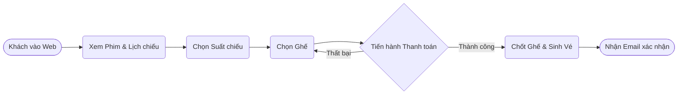
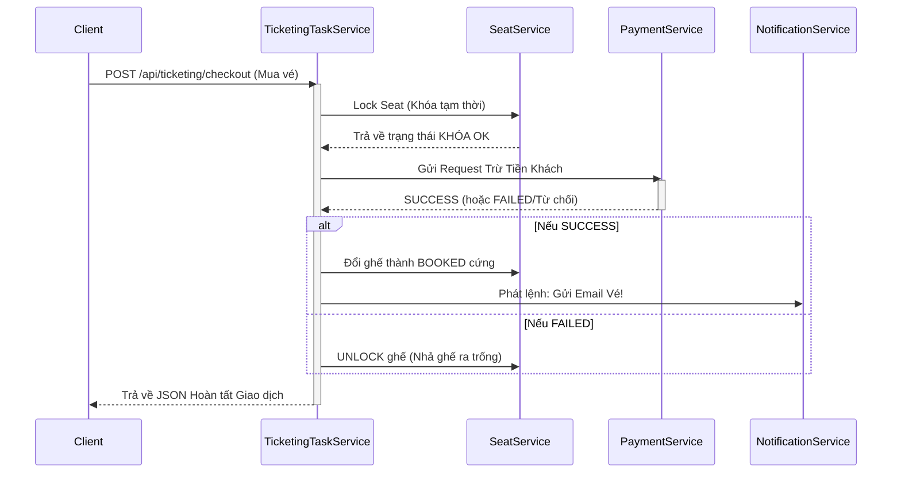
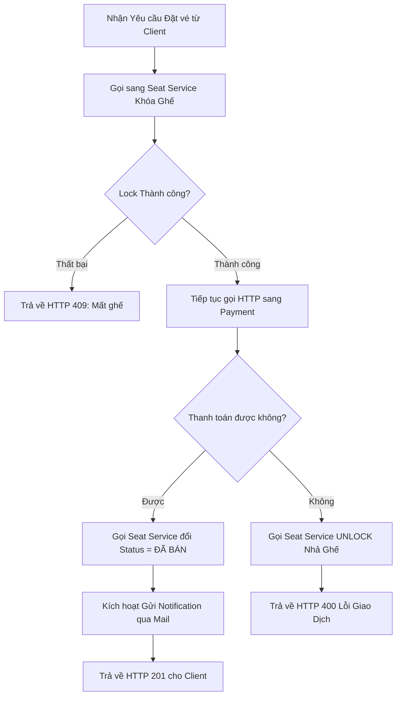
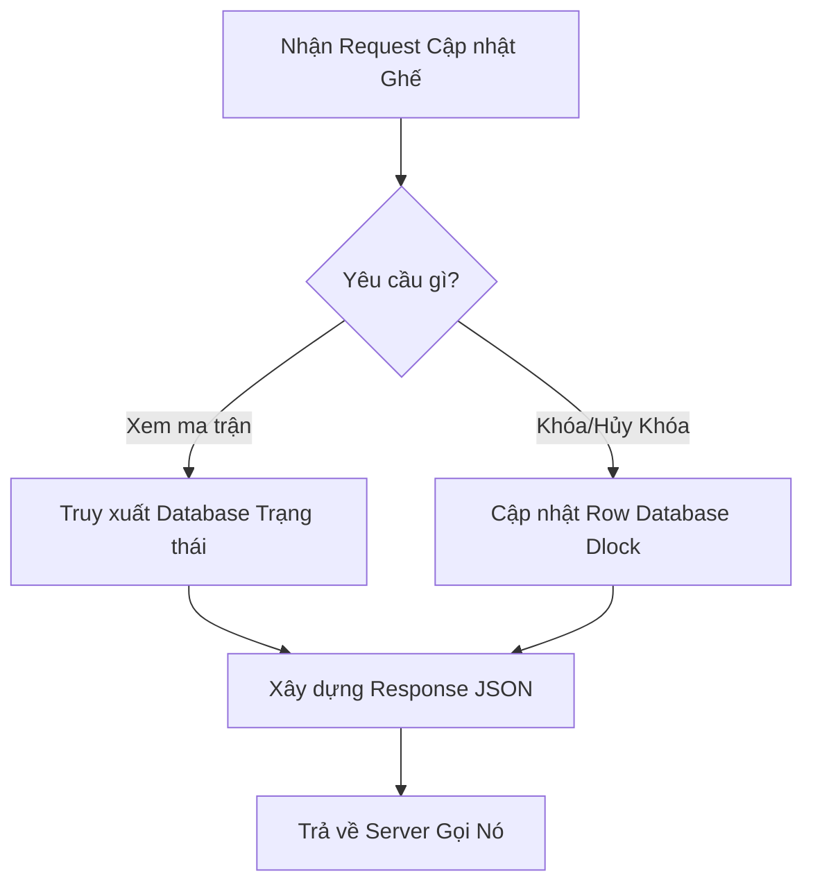

# Analysis and Design — Business Process Automation Solution

> **Goal**: Analyze a specific business process and design a service-oriented automation solution (SOA/Microservices).
> Scope: 4–6 week assignment — focus on **one business process**, not an entire system.

**References:**
1. *Service-Oriented Architecture: Analysis and Design for Services and Microservices* — Thomas Erl (2nd Edition)
2. *Microservices Patterns: With Examples in Java* — Chris Richardson
3. *Bài tập — Phát triển phần mềm hướng dịch vụ* — Hung Dang (available in Vietnamese)

---

## Part 1 — Analysis Preparation

### 1.1 Business Process Definition

Describe or diagram the high-level Business Process to be automated.

- **Domain**: Entertainment / Ticketing (Giải trí / Bán vé)
- **Business Process**: Đặt vé xem phim và thanh toán trực tuyến (Online Movie Ticket Booking & Payment Process)
- **Actors**: Khách hàng (Customer)
- **Scope**: Từ lúc khách chọn phim, chọn giờ chiếu, giữ chỗ trên sơ đồ rạp, thanh toán, cho tới khi hệ thống cấp vé điện tử và gửi thông báo.

**Process Diagram:**

### 1.2 Existing Automation Systems

List existing systems, databases, or legacy logic related to this process.

| System Name | Type | Current Role | Interaction Method |
|-------------|------|--------------|-------------------|
| Payment Gateway (Mock) | API | Cổng thanh toán giả lập bên ngoài (như VNPay, MoMo) để trừ tiền khách hàng. | REST API |
| Email SMTP Server | Service | Hệ thống mail bên ngoài (như SendGrid, Gmail) để gửi vé điện tử. | SMTP/API |

> If none exist, state: *"None — the process is currently performed manually."*

### 1.3 Non-Functional Requirements

Non-functional requirements serve as input for identifying Utility Service and Microservice Candidates in step 2.7.

| Requirement    | Description |
|----------------|-------------|
| Performance    | Hệ thống phải phản hồi tìm kiếm phim dưới 200ms. Tiến trình khóa ghế phản hồi dưới 100ms. |
| Security       | Không được phép gọi trực tiếp qua các service nội bộ nếu chưa có chứng thực truy cập hợp lệ (Auth Gateway). |
| Scalability    | Có thể nhân bản nhanh chóng (Scale out) service Phim & Lịch chiếu độc lập khi có truy cập tải trọng lớn. |
| Availability   | Database giữ ghế phải luôn tuyệt đối nhất quán, không được dính lỗi Concurrency (Hai người thanh toán cùng 1 ghế). |

---

## Part 2 — REST/Microservices Modeling

### 2.1 Decompose Business Process & 2.2 Filter Unsuitable Actions

Decompose the process from 1.1 into granular actions. Mark actions unsuitable for service encapsulation.

| # | Action | Actor | Description | Suitable? |
|---|--------|-------|-------------|-----------|
| 1 | Lấy danh sách Phim & Giờ chiếu | Khách hàng | Fetch dữ liệu Phim, Giờ chiếu từ Database | ✅ |
| 2 | Hiện sơ đồ ghế ngồi | Khách hàng | Lấy ra bản đồ ghế của phòng chiếu | ✅ |
| 3 | Khóa ghế (Locking) | Hệ thống | Khóa tạm thời ghế, chống ghi đè | ✅ |
| 4 | Điền form Visa thủ công | Khách hàng | Người dùng nhập số thẻ hiển thị trên UI | ❌ |
| 5 | Giao dịch qua cổng tiền tệ | Hệ thống | Gửi lệnh trừ số tiền M, nhận trạng thái trả về | ✅ |
| 6 | Cập nhật Vé (Cấp vé) | Hệ thống | Ghi nhận tài khoản khách và Khóa cứng ghế thành công | ✅ |
| 7 | Gửi tin nhắn SMS/Email | Hệ thống | Thông báo mã QR vé điện tử về hòm thư người mua | ✅ |

> Actions marked ❌: manual-only, require human judgment, or cannot be encapsulated as a service.

### 2.3 Entity Service Candidates

Identify business entities and group reusable (agnostic) actions into Entity Service Candidates.

| Entity | Service Candidate | Agnostic Actions |
|--------|-------------------|------------------|
| Movie, Showtime | **Showtime Service** | Lấy danh sách Phim, lấy Lịch chiếu, CRUD dữ liệu điện ảnh. |
| Seat, Room | **Seat Service** | Xem ma trận sơ đồ ghế rạp, Khóa ghế tạm (Lock), Cập nhật thuộc tính Ghế. |
| Payment Transaction | **Payment Service** | Tạo log giao dịch mới, cập nhật giao dịch, Lấy chi tiết lịch sử thanh toán người dùng. |

### 2.4 Task Service Candidate

Group process-specific (non-agnostic) actions into a Task Service Candidate.

| Non-agnostic Action | Task Service Candidate |
|---------------------|------------------------|
| Nhận lệnh Checkout từ Client -> Giao tiếp gọi Seat khóa chỗ -> Gọi Payment trừ tiền -> Cập nhật Seat nhả chốt hay chốt cứng dựa trên kết quả. | **Ticketing Task Service** (Đóng vai trò Nhạc trưởng Orchestration trung tâm của luồng Mua vé). |

### 2.5 Identify Resources

Map entities/processes to REST URI Resources.

| Entity / Process | Resource URI |
|------------------|--------------|
| Movie / Showtime | `/api/movies`, `/api/movies/{id}/showtimes` |
| Seat | `/api/showtimes/{id}/seats` |
| Ticketing Process | `/api/ticketing/checkout` |
| Payment | `/api/payments/process` |

### 2.6 Associate Capabilities with Resources and Methods

| Service Candidate | Capability | Resource | HTTP Method |
|-------------------|------------|----------|-------------|
| Showtime Service | Get Movies | `/api/movies` | GET |
| Seat Service | Get Seats Status | `/api/showtimes/{id}/seats` | GET |
| Ticketing Task Service | Execute Checkout | `/api/ticketing/checkout` | POST |
| Payment Service | Execute Transaction | `/api/payments/process` | POST |

### 2.7 Utility Service & Microservice Candidates

Based on Non-Functional Requirements (1.3) and Processing Requirements, identify cross-cutting utility logic or logic requiring high autonomy/performance.

| Candidate | Type (Utility / Microservice) | Justification |
|-----------|-------------------------------|---------------|
| **API Gateway** | Utility Service | Làm bộ định tuyến duy nhất từ Frontend, check Token bảo mật JWT trước khi phân phát request vào trong. |
| **Notification Service** | Utility Service | Chỉ để đi gửi Email/SMS vé. Việc gửi thường mất vài giây (chậm), nên gom nó ra ngoài làm tiện ích riêng để phục vụ bất đồng bộ. |

### 2.8 Service Composition Candidates

Interaction diagram showing how Service Candidates collaborate to fulfill the business process.

---

## Part 3 — Service-Oriented Design

> Part 3 is the **convergence point** — regardless of whether you used Step-by-Step Action or DDD in Part 2, the outputs here are the same: service contracts and service logic.

### 3.1 Uniform Contract Design

Service Contract specification for each service. Full OpenAPI specs:
- [`docs/api-specs/showtime-service.yaml`](api-specs/showtime-service.yaml)
- [`docs/api-specs/seat-service.yaml`](api-specs/seat-service.yaml)
- [`docs/api-specs/ticketing-task-service.yaml`](api-specs/ticketing-task-service.yaml)
- [`docs/api-specs/payment-service.yaml`](api-specs/payment-service.yaml)

> 💡 **Derive from Part 2:** Each service capability from 2.6 maps to one API endpoint. Update the OpenAPI spec files to match.

**Showtime Service (Entity):**

| Endpoint | Method | Description | Request Body | Response Codes |
|----------|--------|-------------|--------------|----------------|
| `/api/movies` | GET | Lấy danh sách phim | Trống | 200 (OK) |
| `/api/movies/{id}/showtimes` | GET | Lấy khung giờ lịch chiếu | Trống | 200 (OK), 404 (Not Found) |

**Seat Service (Entity):**

| Endpoint | Method | Description | Request Body | Response Codes |
|----------|--------|-------------|--------------|----------------|
| `/api/showtimes/{id}/seats` | GET | Xem trạng thái sơ đồ ghế | Trống | 200 (OK), 404 (Not Found) |
| `/api/showtimes/{id}/seats/lock` | POST | Xin cấp khóa cứng một ghế | `{ seatId: ID }` | 200 (Locked OK), 409 (Conflict) |

**Ticketing Task Service (Process Orchestrator):**

| Endpoint | Method | Description | Request Body | Response Codes |
|----------|--------|-------------|--------------|----------------|
| `/api/ticketing/checkout` | POST | Khởi tạo quy trình mua vé, kích hoạt luồng Saga | `{ showtimeId, seatId, userId }` | 201 (Vé được cấp), 400 (Hết tiền), 409 (Hết ghế) |

### 3.2 Service Logic Design

Internal processing flow for each service.

**Ticketing Task Service (Non-Agnostic Process Logic):**

**Seat Service (Agnostic Data Logic):**

