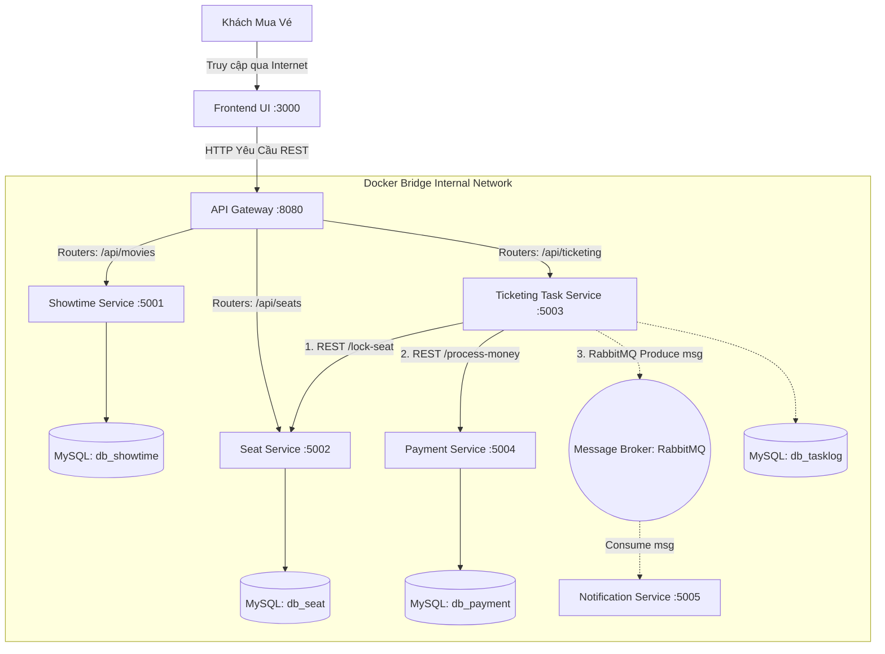

# System Architecture

> This document is completed **after** the Analysis and Design phase.
> Choose **one** analysis approach and complete it first:
> - [Analysis and Design — Step-by-Step Action](analysis-and-design.md)
> - [Analysis and Design — DDD](analysis-and-design-ddd.md)
>
> Both approaches produce the same inputs for this document: **Service Candidates**, **Service Composition**, and **Non-Functional Requirements**.

**References:**
1. *Service-Oriented Architecture: Analysis and Design for Services and Microservices* — Thomas Erl (2nd Edition)
2. *Microservices Patterns: With Examples in Java* — Chris Richardson
3. *Bài tập — Phát triển phần mềm hướng dịch vụ* — Hung Dang (available in Vietnamese)

---

### How this document connects to Analysis & Design

```
┌─────────────────────────────────────────────────────┐
│         Analysis & Design (choose one)              │
│                                                     │
│  Step-by-Step Action        DDD                     │
│  Part 1: Analysis Prep     Part 1: Domain Discovery │
│  Part 2: Decompose →       Part 2: Strategic DDD →  │
│    Service Candidates        Bounded Contexts       │
│  Part 3: Service Design    Part 3: Service Design   │
│    (contract + logic)        (contract + logic)     │
└────────────────┬────────────────────────────────────┘
                 │ inputs: service list, NFRs,
                 │         service contracts (API specs)
                 ▼
┌─────────────────────────────────────────────────────┐
│         Architecture (this document)                │
│                                                     │
│  1. Pattern Selection                               │
│  2. System Components (tech stack, ports)           │
│  3. Communication Matrix                            │
│  4. Architecture Diagram                            │
│  5. Deployment                                      │
└─────────────────────────────────────────────────────┘
```

> 💡 **What you need before starting:** your completed service list from Part 2 (service candidates and their responsibilities) and your service contracts from Part 3 (API endpoints). This document turns those logical designs into a concrete, deployable system architecture.

---

## 1. Pattern Selection

Select patterns based on business/technical justifications from your analysis.

| Pattern | Selected? | Business/Technical Justification |
|---------|-----------|----------------------------------|
| API Gateway | ✅ Có | Cung cấp một điểm vào duy nhất (Single Entry Point) cho Web. Đảm nhận kiểm tra bảo mật (Auth JWT) và điều tuyến (Routing) trước khi chia nhánh vào network nội bộ. |
| Database per Service | ✅ Có | Khẳng định tính cốt lõi của Microservices. Mỗi Entity Service (Showtime, Seat, Payment) sỡ hữu schema Database độc lập, ngăn lỗi sập DB chéo (Single point of failure). |
| Shared Database | ❌ Không | Vi phạm nguyên tắc Loosely Coupled. Gây rủi ro deadlock tranh giành tài nguyên cực cao trong một ứng dụng đặt vé. |
| Saga | ✅ Có | Áp dụng trên `Ticketing Task Service` (Orchestrator). Nếu Payment service báo lỗi không trừ được tiền khách, sinh lệnh bù trừ (Compensating) sang `Seat Service` để **NHẢ LẠI GHẾ (Unlock Seat)**. |
| Event-driven / Message Queue | ✅ Có | Áp dụng cho module Gửi SMS/Email. (Dùng Redis/RabbitMQ). `Publish-Subscribe` giúp luồng Mua vé KHÔNG PHẢI CHỜ tiến trình gửi Email xong mới thành công, mà đẩy vào hàng đợi chạy bất đồng bộ (Async). |
| CQRS | ❌ Không | Cấu trúc rạp phim không có nhu cầu Write và Read chồng chéo lệch tông nhau quá căng tới mức phải phân tách tầng kho dữ liệu. Gây over-engineering. |
| Circuit Breaker | ❌ Không | Bỏ qua ở quy mô môn học để giảm bớt gánh nặng code Config quản lý dự án (Fault tolerance). |
| Service Registry / Discovery | ❌ Không | Ở quy mô cục bộ trên đồ án trường, ta định tuyến nội bộ thông qua tên DNS mặc định của Docker Compose Network. Không dùng Server Eureka. |

> Reference: *Microservices Patterns* — Chris Richardson, chapters on decomposition, data management, and communication patterns.

---

## 2. System Components

| Component     | Responsibility | Tech Stack      | Port  |
|---------------|----------------|-----------------|-------|
| **Frontend**  | Giao diện người dùng mua vé (Client UI)| React.js / Vue.js | 3000  |
| **Gateway**   | Cửa ngõ API duy nhất, gác cổng bảo mật | Spring Cloud Gateway| 8080  |
| **Showtime Svc**| Dịch vụ quản lý phim, giờ phim | Spring Boot (Java) | 5001  |
| **Seat Svc**    | Dịch vụ giữ, lock, unlock ghế rạp | Spring Boot (Java) | 5002  |
| **Ticketing Task**| Nhạc trưởng điều phối luồng Mua vé | Spring Boot (Java) | 5003  |
| **Payment Svc** | Mô phỏng tính tiền ngân hàng | Spring Boot (Java) | 5004  |
| **Notification**| Phát hành thông điệp Email/SMS | Spring Boot (Java) | 5005  |
| **Databases**   | Hệ lưu trữ biệt lập phân tán rẽ nhánh | MySQL (Docker Container) | 3306  |

---

## 3. Communication

### Inter-service Communication Matrix

Quy ước: 
*   **[REST]**: Gọi trực tiếp HTTP Đồng bộ (Synchronous). Đợi trả kết quả.
*   **[AMQP]**: Gửi sự kiện message Bất đồng bộ (Asynchronous) qua RabbitMQ/Kafka. Không cần chờ.

| From → To     | Showtime | Seat Service | Payment Svc | Ticketing Task | Notification Svc | 
|---------------|----------|--------------|-------------|----------------|------------------|
| **Frontend**  | (Chặn)   | (Chặn)       | (Chặn)      | (Chặn)         | (Chặn)           |
| **Gateway**   | [REST]   | [REST]       | (Chặn)      | [REST]         | (Chặn)           |
| **Ticketing Task**|      | [REST] Lock/Unlock| [REST] Process|         | [AMQP] Gửi Mail  |

---

## 4. Architecture Diagram

> Mạng lưới sơ đồ Cấu trúc Vật lý cấp cao (Deployable Server Level). Place diagrams in `docs/asset/` and reference here.



---

## 5. Deployment

- All services containerized with Docker
- Orchestrated via Docker Compose
- Single command: `docker compose up --build`
